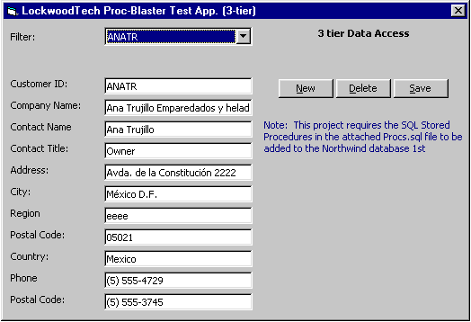



## n/3\-tier/SQL/ADO/Sproc test project

### Description

3-TIER Test project illustrating high performance Data Access for SQL Server using ADO command objects and Stored Procedures in a 3-TIER ENVIRONMENT USING VB CLASSES for Insert, Update, Delete and Select. This project runs on Northwind db.
 
### More Info
 
Need to run Procs.sql 1st. This app. runs on Northwind DB on SQL7

             |
---                |---
**Submitted On**   |2000-09-02 20:01:42
**By**             |[Brian Lockwood](https://github.com/Planet-Source-Code/PSCIndex/blob/master/ByAuthor/brian-lockwood.md)
**Level**          |Intermediate
**User Rating**    |5.0 (20 globes from 4 users)
**Compatibility**  |VB 6\.0
**Category**       |[Databases/ Data Access/ DAO/ ADO](https://github.com/Planet-Source-Code/PSCIndex/blob/master/ByCategory/databases-data-access-dao-ado__1-6.md)
**World**          |[Visual Basic](https://github.com/Planet-Source-Code/PSCIndex/blob/master/ByWorld/visual-basic.md)
**Archive File**   |[CODE\_UPLOAD9540922000\.zip](https://github.com/Planet-Source-Code/brian-lockwood-n-3-tier-sql-ado-sproc-test-project__1-11196/archive/master.zip)

